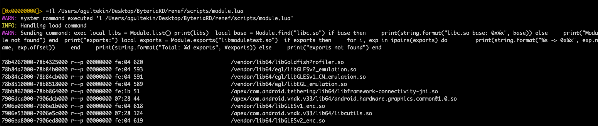
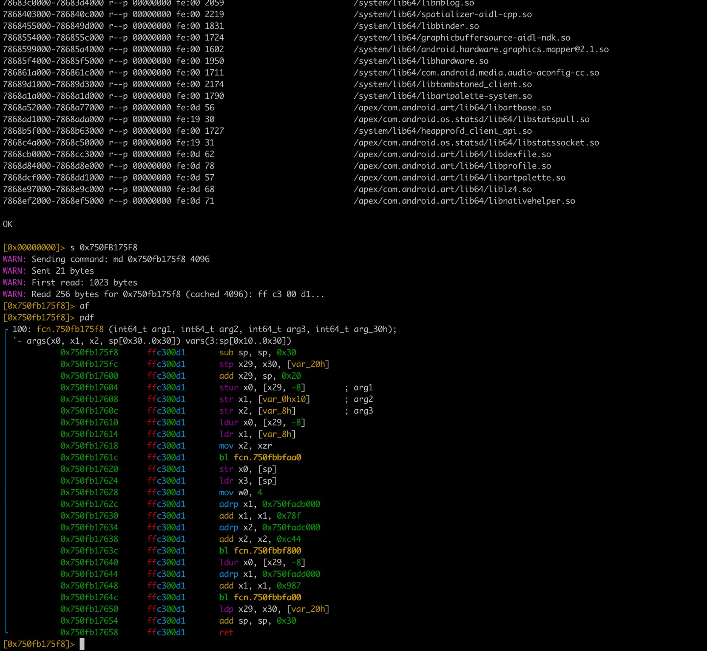
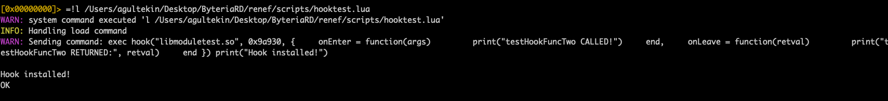
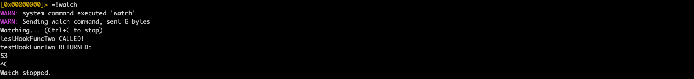
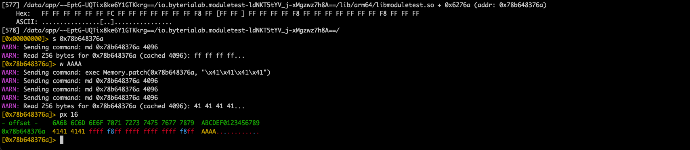

# r2renef

**Renef IO Plugin for Radare2 - Dynamic Android Instrumentation**

[](LICENSE)
[](https://rada.re)
[](https://renef.io)

---

## Overview

r2renef is a Radare2 IO plugin that bridges [Radare2](https://rada.re) with [Renef](https://renef.io), enabling powerful static analysis capabilities on live Android processes. Combine Radare2's disassembly, and scripting with Renef's dynamic instrumentation.

## Features

- **Live Memory Analysis** - Read/write process memory through Radare2
- **Full r2 Integration** - Use `px`, `pd`, `pf` and all r2 commands on live processes
- **Renef Commands** - Access Renef's Lua API via `:` commands
- **Module Inspection** - List loaded modules and exports
- **Memory Search** - Pattern scanning with r2's search capabilities
- **Hooking Support** - Load Lua scripts and watch hook callbacks in real-time

## Requirements

- [Radare2](https://github.com/radareorg/radare2) (>= 5.8.0)
- [Renef](https://github.com/ahmeth4n/renef) running on target Android device
- Android device with ARM64 architecture

## Installation

```bash
# Clone the repository
git clone https://github.com/ahmeth4n/r2renef
cd r2renef

# Build and install
make
make install

# Or with meson
meson setup build
ninja -C build
ninja -C build install
```

## Quick Start

1. Start Renef server on your Android device
2. Connect via ADB port forwarding:
   ```bash
   adb forward tcp:1907 localabstract:com.android.internal.os.RuntimeInit;
   ```
3. Launch r2 with renef URI:
   ```bash
   r2 renef://spawn/com.example.app    # Spawn new process
   r2 renef://attach/12345             # Attach by PID
   ```

## Usage

### Basic Commands

Once connected, use standard Radare2 commands:

```bash
# Disassembly
[0x7f8a1c2b0]> pd 20                    # Disassemble 20 instructions

# Hex dump
[0x7f8a1c2b0]> px 64                    # Print 64 bytes hex

# Seek to address
[0x7f8a1c2b0]> s 0x7f8a1c000            # Seek to address

# Visual mode
[0x7f8a1c2b0]> pdf                       # 
Print disassembled function
```

### Renef Commands (`:`)

Access Renef functionality directly:

```bash
# List applications
[0x7f8a1c2b0]> :la                     # List installed apps

# Execute Lua code
[0x7f8a1c2b0]> :exec Module.list()     # List loaded modules
[0x7f8a1c2b0]> :exec Module.find('libc.so')

# Memory operations
[0x7f8a1c2b0]> :md 0x7f8a1c2b0 64      # Memory dump
[0x7f8a1c2b0]> :ms DEADBEEF            # Memory search

# Hooking
[0x7f8a1c2b0]> :l /path/to/script.lua  # Load and execute Lua script
[0x7f8a1c2b0]> :watch                   # Watch hook callbacks (Ctrl+C to stop)
```

## Screenshots

<p align="center">
  
</p>
<p align="center"><em>Renef commands in action</em></p>

<p align="center">
  
</p>
<p align="center"><em>Decompilation with `pdf` command</em></p>

<p align="center">
  
</p>
<p align="center"><em>Loading Lua hook script with `:l` command</em></p>

<p align="center">
  
</p>
<p align="center"><em>Watching hook callbacks with `:watch` command</em></p>

<p align="center">
  
</p>
<p align="center"><em>Memory patching with `w` command</em></p>

## Example Session

```bash
$ r2 renef://spawn/com.example.app
INFO: Renef injection waiting... sock_fd: 5
INFO: Injection completed. Mode: spawn PID: 12345
INFO: libc base address: 0x7f8a1c000

# Analyze libc
[0x7f8a1c000]> pd 10
            0x7f8a1c000      fd7bbfa9       stp x29, x30, [sp, -0x10]!
            0x7f8a1c004      fd030091       mov x29, sp
            ...

# Search for pattern
[0x7f8a1c000]> /x 504b0304
Searching 4 bytes in [0x7f8a1c000-0x7f8a2c000]
hits: 2
0x7f8a1c100 hit0_0 504b0304

# List modules via Renef
[0x7f8a1c000]> :exec Module.list()
0x7f8a1c000 libc.so
0x7f8a2d000 linker64
0x7f8a3e000 libm.so
...
```

## Roadmap

- [x] Basic IO (read/seek)
- [x] Renef command passthrough (`:`)
- [x] Script loading (`:l`)
- [x] Hook watch (`:watch`)
- [x] Memory write support
- [ ] Debug plugin (breakpoints, stepping)
- [ ] Register access
- [ ] Maps/sections integration

## Related Projects

- [renef](https://github.com/ahmeth4n/renef) - Dynamic Instrumentation Toolkit for Android
- [radare2](https://github.com/radareorg/radare2) - Reverse Engineering Framework
- [r2frida](https://github.com/nowsecure/r2frida) - Radare2 + Frida integration (inspiration)

## Contributing

Contributions are welcome! Feel free to open issues or submit pull requests.

## License

MIT License - see [LICENSE](LICENSE) for details.

